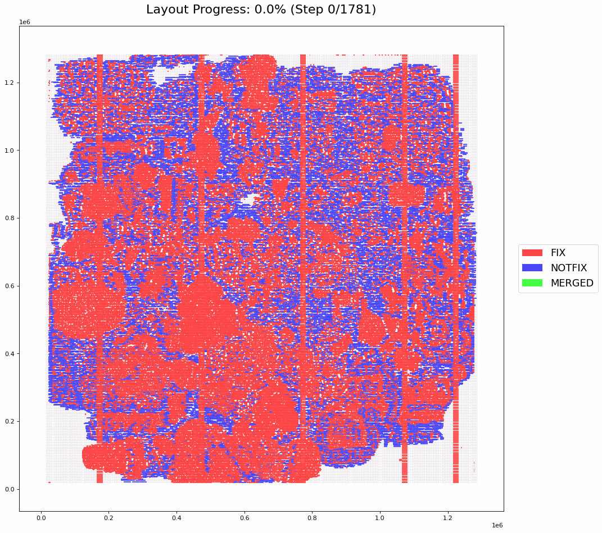

以下是專案的完整說明文件，包含如何執行專案並附上範例。

---

# GifAnimation - Chip Layout Optimization

## **專案簡介**
此專案生成一個動畫 GIF，展示芯片佈局的優化過程。通過提供 `.lg`（初始佈局）、`.opt`（優化步驟）、`.post.lg`（後置結果）三個文件，腳本會可視化芯片佈局從初始狀態到最終優化的變化。

---

## **文件結構**
專案文件結構如下：

```
GifAnimation/
├── input.lg          # 定義芯片初始佈局
├── input.opt         # 優化步驟描述，包括合併操作
├── input_post.lg     # 優化後的佈局結果
├── main.py           # 主腳本，用於生成 GIF
├── readme.md         # 使用說明文件
├── result.gif        # 生成的 GIF，展示佈局優化過程
```

---

## **執行環境需求**
- **Python**: 3.6 或更高版本
- **安裝依賴庫**:
  執行以下命令安裝所需的 Python 庫：
  ```bash
  pip install matplotlib numpy tqdm imageio argparse
  ```

---

## **如何執行**

### **1. 確保文件準備就緒**
確保以下文件在 `GifAnimation` 目錄下，並遵守文件格式：
1. `input.lg`: 描述芯片初始佈局，包括芯片尺寸、放置行和元件信息。
2. `input.opt`: 描述優化步驟，包括要合併的元件和合併後的位置與尺寸。
3. `input_post.lg`: 描述優化後的合併元件位置及其相關的移動元件。

---

### **2. 執行腳本生成 GIF**
在命令行中執行以下命令：
```bash
python main.py --lg input.lg --opt input.opt --post input_post.lg --output result.gif
```

#### **參數說明**：
- `--lg`: 指定 `.lg` 文件的路徑。
- `--opt`: 指定 `.opt` 文件的路徑。
- `--post`: 指定 `.post.lg` 文件的路徑。
- `--output`: （可選）指定生成的 GIF 文件路徑，默認為 `result.gif`。

---

### **3. 查看生成的 GIF**
執行後，`result.gif` 文件會生成在當前目錄中。該 GIF 展示了以下內容：
1. 初始佈局。
2. 每一步的優化過程（包括合併和移動元件的可視化）。
3. 最終的優化佈局。

---

## **範例**

### **範例文件**
#### **input.lg**
```plaintext
Alpha 100
Beta 200
DieSize 0 0 50 30
FF_1_0 8 0 5 10 NOTFIX
FF_1_1 14 0 5 10 NOTFIX
FF_1_2 14 20 5 10 NOTFIX
C4 10 10 5 10 FIX
PlacementRows 0 0 1 10 50
PlacementRows 0 10 1 10 50
PlacementRows 0 20 1 10 50
```

#### **input.opt**
```plaintext
Banking_Cell: FF_1_0 FF_1_1 --> FF_2_0 14 0 10 10
```

#### **input_post.lg**
```plaintext
14 0
2
FF_1_0 8 0
FF_1_1 14 0
```

---

### **執行範例**
使用以下命令執行範例：
```bash
python main.py --lg input.lg --opt input.opt --post input_post.lg --output result.gif
```

執行後，會生成以下 GIF 文件：

- **`result.gif`**:  
  - **初始佈局**: 所有元件（紅色為固定元件，藍色為可移動元件）的位置。
  - **優化步驟**: 顯示合併操作，新的元件以綠色顯示。
  - **最終佈局**: 完整佈局結果，所有合併操作已完成。

---

## **GIF 結果展示**

### **1. 初始佈局**
- 紅色：固定元件（`FIX`）。
- 藍色：可移動元件（`NOTFIX`）。


---

### **2. 優化進行中**
- 合併操作進行中，部分元件被移除並合併為新的元件（綠色）。


---

### **3. 最終佈局**
- 綠色：已完成合併的元件。
- 所有優化步驟已完成。


---

---



---


## **進一步定制**
- 修改顏色：可以在 `main.py` 中更改以下代碼塊調整顏色：
  ```python
  legend_elements = [
      patches.Patch(facecolor="#FF4444", label="FIX"),
      patches.Patch(facecolor="#4444FF", label="NOTFIX"),
      patches.Patch(facecolor="#44FF44", label="MERGED")
  ]
  ```
- 動畫速度：在以下代碼中修改 `fps` 值調整動畫播放速度：
  ```python
  imageio.mimsave(output_path, frames, fps=5, loop=0)
  ```


